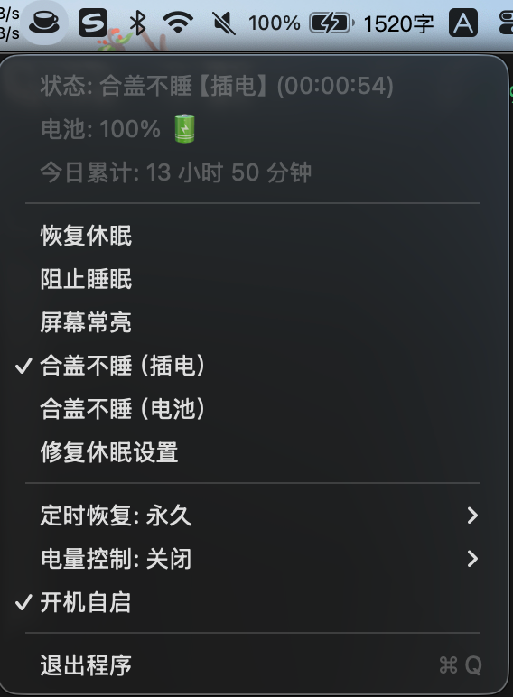

# Matcha

一款 macOS 菜单栏防休眠工具，面向 MacBook 合盖运行和高负载场景（如 AI 编码、长任务执行）。

**语言版本：** [English](README.md) | **简体中文**

<p>
  
</p>

## 功能特点

- 多种防休眠模式：阻止睡眠、屏幕常亮、合盖不睡（插电/电池）、定时模式
- 合盖不睡（电池）：不插电也可合盖运行，并在合盖后请求关闭内建显示屏（需管理员授权）
- 电池智能恢复：低电量自动恢复休眠（可配置阈值）
- 一键恢复：随时回到正常休眠状态
- 定时模式：15 分钟到 24 小时，或永久
- 开机自启

## 安装方式

### 方式一：下载发布包（未签名社区版本）

1. 打开 [Releases](https://github.com/chocoHunter/matcha/releases)。
2. 下载最新 `Matcha.dmg`。
3. 将 `Matcha.app` 拖到 `/Applications`。
4. 若 macOS 提示“无法验证开发者”，可到：
   - `系统设置` -> `隐私与安全性` -> 对 Matcha 点击 `仍要打开`
5. 首次启动时按提示授权。

### 方式二：本地源码构建

可直接使用文末 `如何构建` 章节。

## 使用方法

1. 点击菜单栏 Matcha 图标。
2. 选择一个模式（模式互斥，只会有一个生效）。
3. 随时点击 **恢复休眠** 可回到默认状态。
4. 出现异常时优先点击 **修复休眠设置**。



## 模式区别

| 模式 | 主要作用 | 屏幕是否允许熄灭 | 整机是否允许空闲休眠 | 适合场景 |
| --- | --- | --- | --- | --- |
| **阻止睡眠** | 阻止整机进入空闲休眠 | 允许 | 不允许 | 下载、脚本、后台长任务 |
| **屏幕常亮** | 阻止显示器进入休眠 | 不允许 | 仍可能受其他系统条件影响 | 演示、看板、需要一直看屏幕 |
| **合盖不睡（插电）** | 插电时支持合盖继续运行 | 合盖后允许内建屏幕熄灭 | 不允许 | 插电合盖跑任务 |
| **合盖不睡（电池）** | 电池下合盖继续运行，并在合盖后请求关闭内建显示屏 | 合盖后会请求熄灭内建屏幕 | 不允许 | 合盖后台运行，同时降低发热和显示耗电 |
| **定时模式** | 在指定时长内阻止整机空闲休眠 | 允许 | 在计时结束前不允许 | 临时任务，结束后自动恢复 |

一个实用选择方法：

- 想让 Mac 持续跑任务，但不在乎屏幕亮不亮，用 **阻止睡眠**。
- 主要目标是屏幕一直亮着，用 **屏幕常亮**。
- 只想临时防休眠，用 **定时模式**。
- 想合盖继续运行且不希望内建屏幕持续亮着，用 **合盖不睡（电池）**。

## 电池模式行为说明

- 目标是“合盖后继续运行”，同时尽量不让内建显示屏持续亮着。
- 显示屏关闭是在检测到“开盖 -> 合盖”后触发，通常约 1 秒内生效。
- 再次开盖后，亮屏恢复遵循 macOS 默认行为。

## 故障排查

### 用过电池模式后，合盖休眠行为不正常

1. 在 Matcha 菜单点击 **修复休眠设置**。
2. 若仍异常，执行：

```bash
sudo pmset -b disablesleep 0
sudo pmset restoredefaults
```

3. 断开扩展坞或转接器后再测试。

### 电池模式运行中，但合盖后屏幕没有熄灭

1. 确认使用最新构建版本。
2. 合盖后等待约 1 秒再观察。
3. 断开扩展坞或 HDMI 转接器后复测。
4. 退出并重启 Matcha，再重新启用 **合盖不睡（电池）**。

## 安全说明

- **合盖不睡（电池）** 会通过 `pmset` 修改系统电源策略（需要管理员授权）。
- 启用前会快照当前电池电源设置。
- 停止模式、切换模式、定时结束、退出应用、启动自愈时都会自动恢复设置。

手动紧急恢复：

```bash
sudo pmset -b disablesleep 0
sudo pmset restoredefaults
```

## 项目文档

- `CONTRIBUTING.md`：贡献流程与测试要求
- `CODE_OF_CONDUCT.md`：社区协作行为准则
- `SECURITY.md`：安全漏洞反馈方式
- `CHANGELOG.md`：项目重要变更记录
- `docs/release.md`：发布检查、签名与公证流程

## 如何构建（放在最后）

### 环境要求

- macOS 13.0+（SMAppService）
- Xcode 15.0+
- XcodeGen（`brew install xcodegen`）
- appdmg（`npm install -g appdmg`）
- 需选择完整 Xcode（`xcode-select -p` 指向 `/Applications/Xcode.app/...`）

### 一键构建发布产物

```bash
./scripts/build-release-artifacts.sh
```

### 完整构建流程

```bash
xcodegen generate
"/Applications/Xcode.app/Contents/Developer/usr/bin/xcodebuild" -project Matcha.xcodeproj -scheme Matcha -configuration Release build
```

构建产物路径：

`~/Library/Developer/Xcode/DerivedData/Matcha-*/Build/Products/Release/Matcha.app`

### 手动打包 DMG

```bash
APP_PATH=$(find ~/Library/Developer/Xcode/DerivedData -name "Matcha.app" -type d -path "*/Release/*.app" | head -1)
cat > /tmp/appdmg.json << 'JSON'
{
  "title": "Matcha",
  "window": { "size": { "width": 450, "height": 300 } },
  "contents": [
    { "type": "file", "path": "$APP_PATH", "name": "Matcha.app", "x": 100, "y": 80 },
    { "type": "link", "path": "/Applications", "name": "Applications", "x": 300, "y": 80 }
  ],
  "icon-size": 90
}
JSON
sed -i '' "s|\$APP_PATH|$APP_PATH|g" /tmp/appdmg.json
appdmg /tmp/appdmg.json Matcha.dmg
```

### 命令行构建（不打开 Xcode UI）

```bash
cd Sources
xcrun --sdk macosx swiftc -o Matcha main.swift AppDelegate.swift StatusBarController.swift MatchaManager.swift PowerManager.swift PreferencesManager.swift HistoryManager.swift BatterySleepSupport.swift
```

## 测试

```bash
xcodegen generate
/Applications/Xcode.app/Contents/Developer/usr/bin/xcodebuild -project Matcha.xcodeproj -scheme MatchaTests -sdk macosx test -destination 'platform=macOS'
```

发布产物验证：

```bash
./scripts/build-release-artifacts.sh
```

## 许可证

MIT
